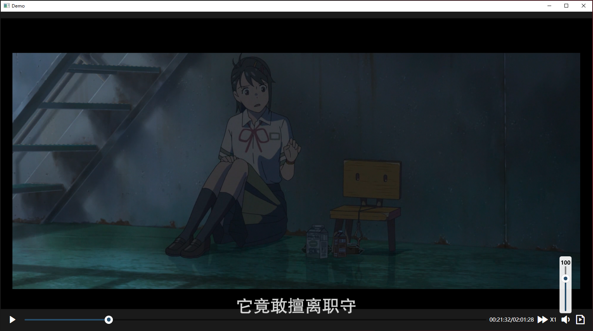
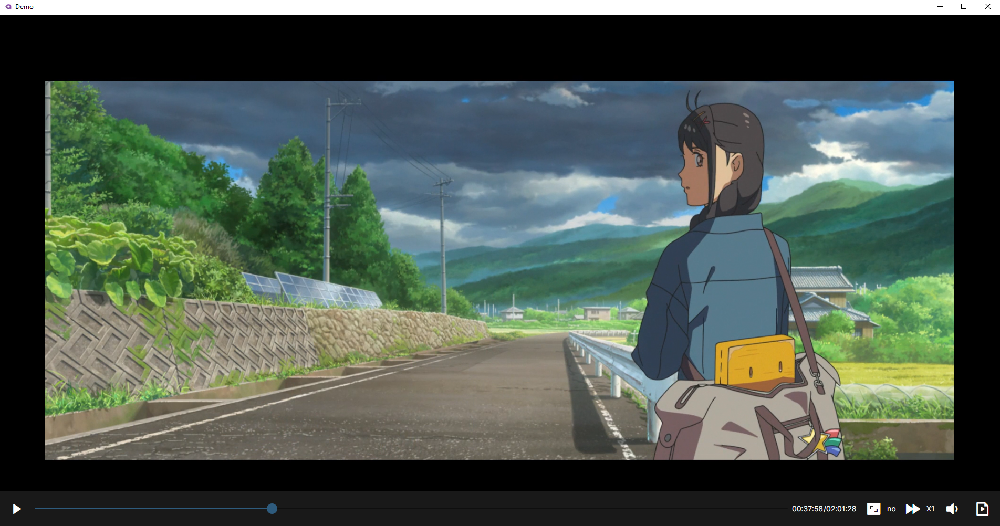
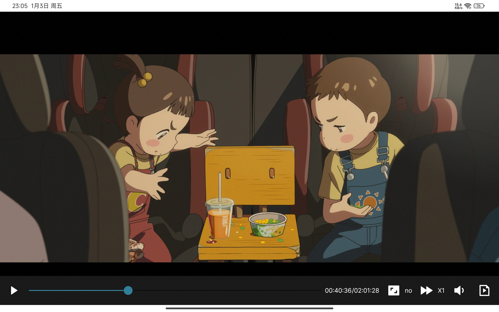
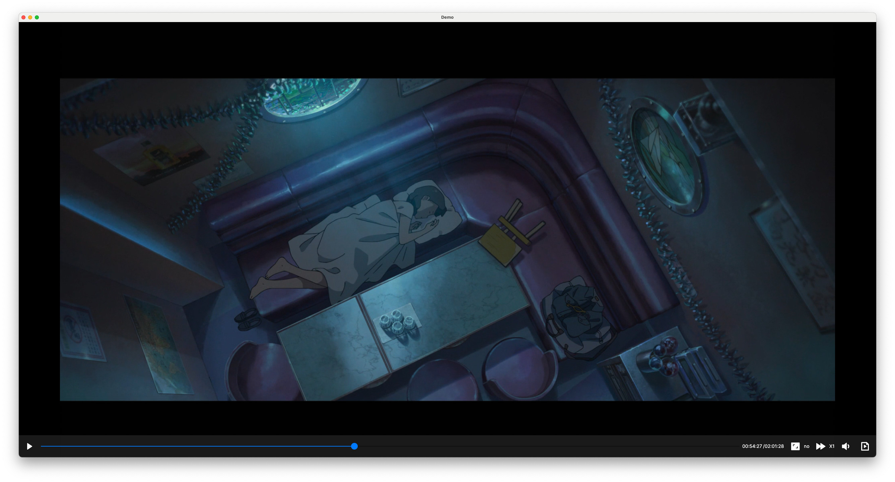

# LibMPV.AutoGen

A CSharp binding repository for [MPV](https://github.com/mpv-player/mpv). Use [CppSharp](https://github.com/mono/CppSharp) to generate csharp binding code. The generated code can be found at LibMPVSharp.

## LibMPVSharp.WPF

Provide a wpf control for the MPV (`VideoView`). Rendered using OpenGL(OpenGL &#8594; D3D by [Silk.net](https://github.com/dotnet/Silk.NET)). So it doesn't have airspace problems.

## LibMPVSharp.Avalonia

Provide an avalonia control for the MPV (`VideoView`). Rendered using OpenGL.

### Windows

### Android

### Mac(test on mac mini m4)

## Native Libraries

The repository do not contain native libraries. Here are some repositories can be used.

- [mpv player (windows)](https://sourceforge.net/projects/mpv-player-windows/files/)
- [mpv-mac](https://github.com/eko5624/mpv-mac)
- [mpv-android](https://github.com/mpv-android/mpv-android)
